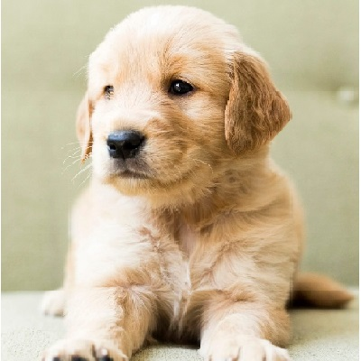

### How it works?
 

### Fitness
The fitness of a key will be calculated based on its SSIM between the encrypted and the original image. The keys with the most fitness (least SSIM) will be chosen as parents for the next generation and the ones with least fitness (most SSIM) will be eliminated.

### SSIM
SSIM (Structural Similarity Index) is a method that calculates the similarity between two images based on 3 key features, luminance contrast and structure. The method returns a value between 0 and 1. A value of 1 meaning the two given images are very similar and 0 meaning that the images are different to each other.

### Results
Image | Encrypted Image
------------ | -------------
 Best fit key: 10100100…. up to 104 bits |  SSIM: 0.01873409749010136
 Best fit key: 11110011 …. up to 104 bits  |  SSIM: 0.008188597751844228
 Best fit key: 11011110…. up to 104 bits |  SSIM:
0.004979959162200745
 Best fit key: 01110100 …. up to 104 bits  |  SSIM:
0.0159365348940872

### Issues
The GA can successfully generate keys when the image size is small. However, if the image size is large, the key generation process can take a longer time depending on the computational power of the machine. This system can also be further modified by increasing the generations or population size keeping in mind the execution time for the same.

#### Note:
The code for logistic chaos mapping (LogisticChaos.py) was taken from:
@RachanaJayaram check out the repository [here](https://github.com/RachanaJayaram/Image-Encryption-Chaos-Maps/blob/master/ChaosEncryption.ipynb) 
It was modified to accept binary sequences as keys.
