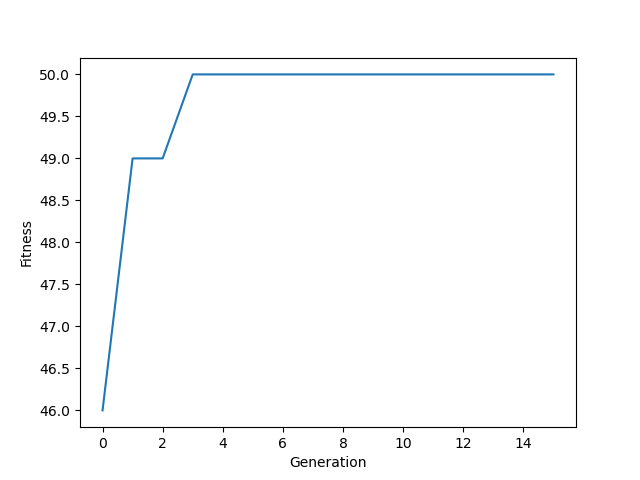

### Solving 0-1 Knapsack problem using Genetic Algorithm

#### Consider an example:
```
items = 10
capacity = 25
WEIGHTS = [4, 5, 7, 4, 3, 3, 7, 2, 8, 9]
PROFIT = [3, 1, 12, 6, 5, 11, 15, 6, 9, 4]
```
#### Fitness
The fitness will be calculated based on the profit of the individual in the population. The top two individuals with best profit will be chosen as parents for the next generation. If the weight of an individual exceeds the capacity, that individual will be eliminated from the population.
#### Fitness graph:
 

#### Solution
```
0011011100 
Profit: 50
```
